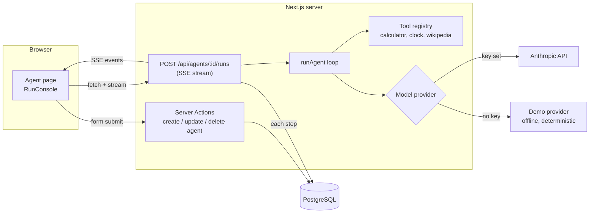

# Agentdeck

Build AI agents with tools, run them, and watch every step they take.

Each agent has its own instructions and a set of tools it is allowed to call. When you run one, every model turn, tool call and tool result streams into the browser as it happens, and the whole run is saved so you can open it later and see exactly how the agent reached its answer.

It works out of the box with a deterministic offline model, so you can clone it and try it without an API key. Add an Anthropic key and the same agents run on Claude.

[](https://github.com/s-talha/agentdeck/actions/workflows/ci.yml)

<!-- Add screenshots to docs/ and link them here: agent list, live run, saved run. -->

## Features

- **Agents with scoped tools.** Each agent can only call the tools you enable. The model cannot reach anything else.
- **Live run trace.** Runs stream over Server-Sent Events. Model turns, tool calls and results appear one by one, and you can stop a run mid-flight.
- **Run history.** Every step is persisted with token counts and timing, so any past run can be replayed as a trace.
- **Built-in tools:** a safe arithmetic evaluator (no `eval`), a time zone aware clock, and a Wikipedia lookup pinned to a single host.
- **Auth:** email and password (bcrypt), plus optional GitHub sign-in through Auth.js.
- **Guard rails:** per-agent step limits, a per-user hourly run quota, ownership checks on every query, and input validation with Zod on both forms and API.

## Stack

| Layer | Choice |
| --- | --- |
| Framework | Next.js 16 (App Router, Server Components, Server Actions), React 19, TypeScript (strict) |
| Data | PostgreSQL, Prisma |
| Auth | Auth.js v5 with the Prisma adapter |
| UI | Tailwind CSS v4, IBM Plex Sans and Mono |
| Model | Anthropic Messages API over `fetch`, with an offline demo provider |
| Testing | Vitest (unit), Playwright (end to end) |
| Delivery | GitHub Actions, Docker (standalone output), docker compose |

## Architecture



### The agent loop

`src/lib/agent/runner.ts` is an async generator. It sends the conversation to the model, and if the model asks for tools it runs them, appends the results, and asks again. It stops when the model answers without a tool call or when the agent's step limit is reached. Because it yields events instead of writing to a socket or a database, the same loop is used by the API route (which streams and persists) and by the unit tests (which just collect the events).

Tool failures never crash a run. Invalid input, unknown tools and timeouts come back to the model as error results so it can correct itself, which is how production agent loops behave.

### Request flow for a run

1. The browser POSTs the task to `/api/agents/:id/runs`.
2. The route checks the session, validates the body, loads the agent scoped to the current user, and checks the hourly quota.
3. It creates a `Run` row, then returns a `ReadableStream` of SSE events while the loop executes.
4. Each text, tool call and tool result is written as a `RunStep`. When the loop ends, the run gets its final status, output, token usage and duration.
5. If the browser disconnects, the request signal aborts the loop and the run is recorded as cancelled.

## Getting started

Requirements: Node.js 20.9 or newer, and Docker (for Postgres) or any Postgres 15+ database.

```bash
git clone https://github.com/s-talha/agentdeck.git
cd agentdeck
cp .env.example .env            # then set AUTH_SECRET (npx auth secret)
docker compose up -d db
npm install
npm run db:migrate -- --name init
npm run db:seed                 # optional: demo@agentdeck.dev / agentdeck-demo
npm run dev
```

Open http://localhost:3000 and create an account, or sign in with the seeded demo user.

To run agents on Claude, set `ANTHROPIC_API_KEY` in `.env`. `ANTHROPIC_MODEL` picks the model.

### Running the whole stack in Docker

```bash
export AUTH_SECRET=$(openssl rand -base64 32)
docker compose --profile app up --build
```

This starts Postgres, applies the schema, and serves the production build on port 3000.

## Scripts

| Command | What it does |
| --- | --- |
| `npm run dev` | Start the dev server |
| `npm run build` / `npm start` | Production build and server |
| `npm run lint` | ESLint (Next.js core web vitals + TypeScript rules) |
| `npm run typecheck` | `tsc --noEmit` |
| `npm test` | Vitest unit tests |
| `npm run test:e2e` | Playwright tests (starts the app for you) |
| `npm run db:migrate` | Create and apply a migration in development |
| `npm run db:seed` | Seed the demo user and two agents |

## Testing

Unit tests cover the parts with real logic: the expression evaluator (precedence, associativity, error cases, nesting limits), the agent loop (tool round trips, disallowed tools, invalid tool input, step limits, provider failures, cancellation), SSE framing across chunk boundaries, and validation rules.

The end-to-end suite signs up a fresh user, builds an agent, runs it, checks the streamed trace and the saved run, and verifies that one user cannot view or run another user's agent. It uses the offline model, so it is deterministic and needs no secrets in CI.

## Design decisions

- **Authorisation lives next to the data.** Every query filters by `userId`, and updates and deletes use `updateMany` / `deleteMany` with the owner in the `where` clause, so the ownership check and the write are one statement. Another user's agent id returns 404, not 403, so ids can't be probed. There is no middleware-only protection to bypass.
- **SSE over WebSockets.** Runs are one-way streams that end, which is exactly what SSE is for. It works through the standard `fetch` API and needs no extra server.
- **No SDK for the model call.** The provider is about 60 lines of `fetch` against the Messages API. Internal message types mirror that API, so there is no translation layer, and swapping in another provider means implementing one interface.
- **An offline provider is a first-class citizen.** It makes the app usable from a fresh clone, keeps CI free of secrets, and makes end-to-end tests deterministic.
- **Safe tools by construction.** The calculator is a recursive descent parser with length and depth limits instead of `eval`. The Wikipedia tool only accepts a title and builds the URL itself, so the model cannot point it at internal addresses.
- **JWT sessions.** Auth.js requires them for credentials sign-in. The Prisma adapter still stores users and linked GitHub accounts.

## Project structure

```
src/
  app/
    (auth)/            sign in, sign up, auth server actions
    (app)/agents/      agent list, create/edit forms, agent page, saved runs
    api/agents/[id]/runs/route.ts   streaming run endpoint
  components/          trace view and UI primitives
  lib/agent/           runner, providers, tools, calculator, shared types
  lib/                 db client, SSE helpers, validation, utilities
  auth.ts              Auth.js configuration
prisma/                schema and seed
tests/unit/            Vitest
tests/e2e/             Playwright
```

## License

MIT
